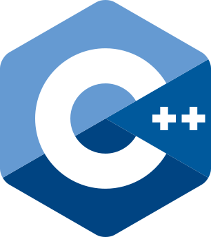

# Awesome Multivector Retrieval

An extensive and commented list of resources on late-interaction multivector retrieval.

## Contents
- [Awesome Multivector Retrieval](#awesome-multivector-retrieval)
	- [Contents](#contents)
	- [Models](#models)
		- [Foundational Models](#foundational-models)
		- [General Models \& Training](#general-models--training)
		- [Compression \& Token Pruning](#compression--token-pruning)
		- [Multimodal \& Vision](#multimodal--vision)
		- [Theory \& Analysis](#theory--analysis)
	- [Retrieval](#retrieval)
		- [Indexing \& Search Algorithms](#indexing--search-algorithms)
		- [Scoring Kernels](#scoring-kernels)
	- [Software Libraries](#software-libraries)
		- [Training \& Inference Frameworks](#training--inference-frameworks)
		- [Retrieval Engines \& Indexes](#retrieval-engines--indexes)
		- [Scoring Kernels](#scoring-kernels-1)
	- [Model Checkpoints](#model-checkpoints)
		- [General-Purpose](#general-purpose)
		- [Specialized / Domain](#specialized--domain)
	- [Datasets and Encodings](#datasets-and-encodings)
	  - [`MS MARCO v1`](#ms-marco-v1)
	  - [`LoTTE-pooled`](#lotte-pooled)
	- [Multimedia Resources](#multimedia-resources)

## Models

### Foundational Models

- *ColBERT: Efficient and Effective Passage Search via Contextualized Late Interaction over BERT* 
	Omar Khattab, Matei Zaharia 
	SIGIR, 2020 
	📄 [paper](https://doi.org/10.1145/3397271.3401075) | 🛠️ [code](https://github.com/stanford-futuredata/ColBERT)

- *COIL: Revisit Exact Lexical Match in Information Retrieval with Contextualized Inverted List* 
	Luyu Gao, Zhuyun Dai, Jamie Callan 
	NAACL, 2021 
	📄 [paper](https://doi.org/10.18653/v1/2021.naacl-main.241)

- *ColBERTv2: Effective and Efficient Retrieval via Lightweight Late Interaction* 
	Keshav Santhanam, Omar Khattab, Jon Saad-Falcon, Christopher Potts, Matei Zaharia 
	NAACL, 2022 
	📄 [paper](https://doi.org/10.18653/v1/2022.naacl-main.272) | 🛠️ [code](https://github.com/stanford-futuredata/ColBERT)

### General Models & Training

- *PyLate: Flexible Training and Retrieval for Late Interaction Models* 
	Antoine Chaffin, Raphaël Sourty 
	CIKM, 2025 
	📄 [paper](https://doi.org/10.1145/3746252.3761608) | 🛠️ [code](https://github.com/lightonai/pylate)

- *ColBERT-Zero: To Pre-train Or Not To Pre-train ColBERT models* 
	Antoine Chaffin, Luca Arnaboldi, Amélie Chatelain, Florent Krzakala 
	arXiv, 2026 
	📄 [paper](https://arxiv.org/abs/2602.16609)

- *A Replicability Study of XTR* 
	Rohan Jha, Reno Kriz, Benjamin Van Durme 
	arXiv, 2026 
	📄 [paper](https://arxiv.org/abs/2605.00646)

- *Your Embedding Model is SMARTer Than You Think* 
	Jianrui Zhang, Hyun Jung Lee, Sukanta Ganguly, Tae-Eui Kam, Donghyun Kim, Yong Jae Lee 
	arXiv, 2026 
	📄 [paper](https://arxiv.org/abs/2605.24938) | 🛠️ [code](https://github.com/HanSolo9682/SMART)

- *Party is over: regularizing ColBERT models to fix efficient ANN methods* 
	LightOn AI 
	Blog, 2026 
	📝 [blog](https://huggingface.co/blog/lightonai/lateon-regularization)

- *NumColBERT: Non-Intrusive Numeracy Injection for Late-Interaction Retrieval Models* 
	Haruki Fujimaki, Makoto P. Kato 
	arXiv, 2026 
	📄 [paper](https://arxiv.org/abs/2605.10109)

- *mDenseOn with the mLateOn: Open Multilingual, Long-Context, and Code Retrieval Models* 
	LightOn AI 
	Blog, 2026 
	📝 [blog](https://huggingface.co/blog/lightonai/mdenseon-mlateon)

- *Jina-ColBERT-v2: A General-Purpose Multilingual Late Interaction Retriever* 
	Rohan Jha, Bo Wang, Michael Günther, Georgios Mastrapas, Saba Sturua, Isabelle Mohr, Andreas Koukounas, Mohammad Kalim Akram, Nan Wang, Han Xiao 
	MRL Workshop, 2024 
	📄 [paper](https://doi.org/10.18653/v1/2024.mrl-1.11)

### Compression & Token Pruning

- *Introducing Neural Bag of Whole-Words with ColBERTer: Contextualized Late Interactions using Enhanced Reduction* 
	Sebastian Hofstatter, Omar Khattab, Sophia Althammer, Mete Sertkan, Allan Hanbury 
	CIKM, 2022 
	📄 [paper](https://doi.org/10.1145/3511808.3557367) | 🛠️ [code](https://github.com/sebastian-hofstaetter/colberter)

- *Joint Optimization of Multi-Vector Representation with Product Quantization* 
	Yufan Fang, Jing Zhan, Yiqun Liu, Jiafeng Mao, Min Zhang, Shaoping Ma 
	NLPCC, 2022 
	📄 [paper](https://doi.org/10.1007/978-3-031-17120-8_49)

- *Multi-Vector Retrieval as Sparse Alignment* 
	Yujie Qian, Jinhyuk Lee, Sai Meher Karthik Duddu, Zhuyun Dai, Siddhartha Brahma, Iftekhar Naim, Tao Lei, Vincent Y. Zhao 
	arXiv, 2022 
	📄 [paper](https://arxiv.org/abs/2211.01267)

- *CITADEL: Conditional Token Interaction via Dynamic Lexical Routing for Efficient and Effective Multi-Vector Retrieval* 
	Minghan Li, Sean C. Lin, Barlas Oguz, Arnab Ghoshal, Jimmy Lin, Yashar Mehdad, Wen-tau Yih, Xilun Chen 
	ACL, 2023 
	📄 [paper](https://doi.org/10.18653/v1/2023.acl-long.663)

- *SLIM: Sparsified Late Interaction for Multi-Vector Retrieval with Inverted Indexes* 
	Minghan Li, Sheng-Chieh Lin, Xueguang Ma, Jimmy Lin 
	SIGIR, 2023 
	📄 [paper](https://doi.org/10.1145/3539618.3591977)

- *Rethinking the Role of Token Retrieval in Multi-Vector Retrieval* 
	Jinhyuk Lee, Zhuyun Dai, Sai Meher Karthik Duddu, Tao Lei, Iftekhar Naim, Ming-Wei Chang, Vincent Y. Zhao 
	NeurIPS, 2023 
	📄 [paper](https://dl.acm.org/doi/10.5555/3666122.3666799)

- *SPLATE: Sparse Late Interaction Retrieval* 
	Thibault Formal, Stephane Clinchant, Herve Dejean, Carlos Lassance 
	SIGIR, 2024 
	📄 [paper](https://doi.org/10.1145/3626772.3657968)

- *Muvera: Multi-Vector Retrieval via Fixed Dimensional Encodings* 
	Laxman Dhulipala, Majid Hadian, Rajesh Jayaram, Jason Lee, Vahab Mirrokni 
	NeurIPS, 2024 
	📄 [paper](https://doi.org/10.52202/079017-3204)

- *Enhancing ColBERT: A Method for Reducing Space Complexity and Accelerating Retrieval Speed* 
	Hai Nguyen T., Huong Le T. 
	PACLIC, 2024 
	📄 [paper](https://aclanthology.org/2024.paclic-1.79/)

- *Token Pruning Optimization for Efficient Multi-vector Dense Retrieval* 
	Shanxiu He, Mutasem Al-Darabsah, Suraj Nair, Jonathan May, Tarun Agarwal, Tao Yang, Choon Hui Teo 
	ECIR, 2025 
	📄 [paper](https://doi.org/10.1007/978-3-031-88708-6_7)

- *CRISP: Clustering Multi-Vector Representations for Denoising and Pruning* 
	João Veneroso, Rajesh Jayaram, Jinmeng Rao, Gustavo Hernández Ábrego, Majid Hadian, Daniel Cer 
	arXiv, 2025 
	📄 [paper](https://arxiv.org/abs/2505.11471)

- *Towards Lossless Token Pruning in Late-Interaction Retrieval Models* 
	Yuxuan Zong, Benjamin Piwowarski 
	SIGIR, 2025 
	📄 [paper](https://doi.org/10.1145/3726302.3730100)

- *ColPruner: Combining Complementary Pruning Approaches for ColBERT in Web Search* 
	Wondo Rhee, Chan Lim, Taewon Yoon, Gyuhyeon Choi, Jooyoung Lee 
	SIGIR Workshop, 2025 
	📄 [paper](https://www.researchgate.net/publication/397009313_ColPruner_Combining_Complementary_Pruning_Approaches_for_ColBERT_in_Web_Search)

- *Sculpting the Vector Space: Towards Efficient Multi-Vector Visual Document Retrieval via Prune-then-Merge Framework* 
	Yibo Yan, Mingdong Ou, Yi Cao, Xin Zou, Jiahao Huo, Shuliang Liu, James Kwok, Xuming Hu 
	arXiv, 2026 
	📄 [paper](https://arxiv.org/abs/2602.19549)

- *Multi-Vector Index Compression in Any Modality* 
	Hanxiang Qin, Alexander Martin, Rohan Jha, Chunsheng Zuo, Reno Kriz, Benjamin Van Durme 
	SIGIR, 2026 
	📄 [paper](https://arxiv.org/abs/2602.21202) | 🛠️ [code](https://github.com/hanxiangqin/omni-col-press)

- *A Brief Comparison of Training-Free Multi-Vector Sequence Compression Methods* 
	Rohan Jha, Chunsheng Zuo, Reno Kriz, Benjamin Van Durme 
	ECIR (LIR Workshop), 2026 
	📄 [paper](https://arxiv.org/abs/2603.22434)

- *Learn to Pool: Lightweight Fine-Tuning for Flexible Multi-Vector Compression* 
	Stefan Josef 
	ECIR (LIR Workshop), 2026 
	📄 [paper](https://arxiv.org/abs/2607.06036)

- *A Voronoi Cell Formulation for Principled Token Pruning in Late-Interaction Retrieval Models* 
	Yash Kankanampati, Yuxuan Zong, Nadi Tomeh, Benjamin Piwowarski, Joseph Le Roux 
	SIGIR, 2026 
	📄 [paper](https://arxiv.org/abs/2603.09933)

- *Comparing Token Pruning Approaches for Multi-Vector Retrieval* 
	Ferdinand Schlatt, Hanno Barschel, Matthias Hagen 
	SIGIR, 2026 
	📄 [paper](https://doi.org/10.1145/3805712.3808564)

### Multimodal & Vision

- *ColPali: Efficient Document Retrieval with Vision Language Models* 
	Manuel Faysse, Hugues Sibille, Tony Wu, Bilel Omrani, Gautier Viaud, Celine Hudelot, Pierre Colombo 
	ICLR, 2025 
	📄 [paper](https://doi.org/10.48550/arXiv.2407.01449)

- *Video-ColBERT: Contextualized Late Interaction for Text-to-Video Retrieval* 
	Arun V. Reddy, Alexander Martin, Eugene Yang, Andrew Yates, Kate Sanders, Kenton Murray, Reno Kriz, Celso M. de Melo, Benjamin Van Durme, Rama Chellappa 
	CVPR, 2025 
	📄 [paper](https://doi.org/10.48550/arXiv.2503.19009)

- *ColMate: Contrastive Late Interaction and Masked Text for Multimodal Document Retrieval* 
	Ahmed Masry, Megh Thakkar, Patrice Bechard, Sathwik Tejaswi Madhusudhan, Rabiul Awal, Shambhavi Mishra, Akshay Kalkunte Suresh, Srivatsava Daruru, Enamul Hoque, Spandana Gella, Torsten Scholak, Sai Rajeswar 
	EMNLP, 2025 
	📄 [paper](https://doi.org/10.18653/v1/2025.emnlp-industry.145)

### Theory & Analysis

- *Multi-Vector Embeddings are Provably More Expressive than Single Vector Embeddings* 
	Rajesh Jayaram 
	arXiv, 2026 
	📄 [paper](https://arxiv.org/abs/2606.23475)

- *Quantifying and Expanding the Theoretical Capacity of Late-Interaction Retrieval Models* 
	Julian Killingback, Varad Ingale, Hamed Zamani, Cameron Musco 
	arXiv, 2026 
	📄 [paper](https://arxiv.org/abs/2607.05803)

## Retrieval

### Indexing & Search Algorithms

- *Baleen: Robust Multi-Hop Reasoning at Scale via Condensed Retrieval* 
	Omar Khattab, Christopher Potts, Matei Zaharia 
	NeurIPS, 2021 
	📄 [paper](https://proceedings.neurips.cc/paper/2021/hash/e8b1cbd05f6e6a358a81dee52493dd06-Abstract.html)

- *PLAID: An Efficient Engine for Late Interaction Retrieval* 
	Keshav Santhanam, Omar Khattab, Christopher Potts, Matei Zaharia 
	CIKM, 2022 
	📄 [paper](https://doi.org/10.1145/3511808.3557325) | 🛠️ [code](https://github.com/stanford-futuredata/ColBERT)

- *DESSERT: An Efficient Algorithm for Vector Set Search with Vector Set Queries* 
	Joshua Engels, Benjamin Coleman, Vihan Lakshman, Anshumali Shrivastava 
	NeurIPS, 2023 
	📄 [paper](https://dl.acm.org/doi/10.5555/3666122.3669096)

- *Efficient Multi-Vector Dense Retrieval with Bit Vectors* 
	Franco Maria Nardini, Cosimo Rulli, Rossano Venturini 
	ECIR, 2024 
	📄 [paper](https://doi.org/10.1007/978-3-031-56060-6_1) | 🛠️ [code](https://github.com/CosimoRulli/emvb)

- *A Reproducibility Study of PLAID* 
	Sean MacAvaney, Nicola Tonellotto 
	SIGIR, 2024 
	📄 [paper](https://doi.org/10.1145/3626772.3657856)

- *Efficient Constant-Space Multi-vector Retrieval* 
	Sean MacAvaney, Antonio Mallia, Nicola Tonellotto 
	ECIR, 2025 
	📄 [paper](https://doi.org/10.1007/978-3-031-88714-7_22)

- *IGP: Efficient Multi-Vector Retrieval via Proximity Graph Index* 
	Ziyang Bian, Man Lung Yiu, Buzhou Tang 
	SIGIR, 2025 
	📄 [paper](https://doi.org/10.1145/3726302.3730004) | 🛠️ [code](https://github.com/DBGroup-SUSTech/multi-vector-retrieval)

- *WARP: An Efficient Engine for Multi-Vector Retrieval* 
	Joel L. Scheerer, Matei Zaharia, Christopher Potts, Gustavo Alonso, Omar Khattab 
	SIGIR, 2025 
	📄 [paper](https://doi.org/10.1145/3726302.3729904) | 🛠️ [code](https://github.com/jlscheerer/xtr-warp)

- *Multivector Reranking in the Era of Strong First-Stage Retrievers* 
	Silvio Martinico, Franco Maria Nardini, Cosimo Rulli, Rossano Venturini 
	ECIR, 2026 
	📄 [paper](https://doi.org/10.1007/978-3-032-21324-2_4) | 🛠️ [code](https://github.com/TusKANNy/papers_reproducibility/tree/main/ecir2026) | 🛠️ [code](https://github.com/TusKANNy/kannolo)

- *SMVE: Sparse Multi-Vector Retrieval* 
	Martin Spisak, Marek Galovic 
	ECIR, 2026 
	📄 [blog](https://www.topk.io/blog/20260311-smve-multi-vector-retrieval)

- *No More K-means: Single-Stage Sparse Coding for Efficient Multi-Vector Retrieval* 
	Lixuan Guo, Yifei Wang, Tiansheng Wen, Aosong Feng, Stefanie Jegelka, Chenyu You 
	ICML, 2026 
	📄 [paper](https://arxiv.org/abs/2605.30120)

- *LEMUR: Learned Multi-Vector Retrieval* 
	Elias Jääsaari, Ville Hyvönen, Teemu Roos 
	ICML, 2026 
	📄 [paper](https://arxiv.org/abs/2601.21853) | 🛠️ [code](https://github.com/ejaasaari/lemur)

- *Efficient Multivector Retrieval with Token-Aware Clustering and Hierarchical Indexing* 
	Silvio Martinico, Franco Maria Nardini, Cosimo Rulli, Rossano Venturini 
	SIGIR, 2026 
	📄 [paper](https://arxiv.org/abs/2604.28142) | 🛠️ [code](https://github.com/TusKANNy/tachiom)

- *ColBERTSaR: Sparsified ColBERT Index via Product Quantization* 
	Eugene Yang, Andrew Yates, Dawn Lawrie, James Mayfield, Saron Samuel, Rohan Jha 
	SIGIR, 2026 
	📄 [paper](https://arxiv.org/abs/2606.05568) | 🛠️ [code](https://github.com/hltcoe/ColBERTSaR)

- *Reproduction Beyond Benchmarks: ConstBERT and ColBERT-v2 Across Backends and Query Distributions* 
	Utshab Kumar Ghosh, Ashish David, Shubham Chatterjee 
	SIGIR, 2026 
	📄 [paper](https://arxiv.org/abs/2604.09982)

- *PLAID-PRF: Pseudo-Relevance Feedback with Centroid-like Tokens in PLAID* 
	Xiao Wang, Sean MacAvaney, Craig Macdonald 
	SIGIR, 2026 
	📄 [paper](https://doi.org/10.1145/3805712.3809690) | 🛠️ [code](https://github.com/cmacdonald/pyterrier_colbert2)

### Scoring Kernels

- *FLASH-MAXSIM: IO-Aware Fused Kernels for Late-Interaction Scoring* 
	Roi Pony, Adi Raz Goldfarb, Idan Friedman, Daniel Ezer, Udi Barzelay 
	arXiv, 2026 
	📄 [paper](https://arxiv.org/abs/2605.29517) | 🛠️ [code](https://github.com/roipony/flash-maxsim)

- *TileMaxSim: IO-Aware GPU MaxSim Scoring with Dimension Tiling and Fused Product Quantization* 
	Ashutosh Sharma 
	arXiv, 2026 
	📄 [paper](https://arxiv.org/abs/2606.26439) | 🛠️ [code](https://github.com/ashutoshuiuc/tilemaxsim)

## Software Libraries

### Training & Inference Frameworks

- [ColBERT](https://github.com/stanford-futuredata/ColBERT)  
	*Reference implementation for ColBERT and ColBERTv2, and includes PLAID support for efficient late-interaction retrieval.*

- [RAGatouille](https://github.com/AnswerDotAI/RAGatouille)  
	*Python toolkit to train and serve ColBERT-based late-interaction retrievers.*

- [PyLate](https://github.com/lightonai/pylate)  
	*Python library for training, fine-tuning, inference, and retrieval with ColBERT-style late-interaction models on single and multi-GPU setups.*

- [PyLate-rs](https://github.com/lightonai/pylate-rs)   
	*High-performance Rust inference engine for PyLate models, with Python bindings and optimized integration with FastPlaid for retrieval pipelines.*

### Retrieval Engines & Indexes

- [FastPlaid](https://github.com/lightonai/fast-plaid)  
	*GPU-optimized engine for ColBERT/PLAID-style late-interaction retrieval.*

- [kANNolo](https://github.com/TusKANNy/kannolo)   
	*ANN library for dense, sparse, and multivector retrieval.*

- [Vectorium](https://github.com/TusKANNy/vectorium)  
	*Rust library for compact storage/access of dense, sparse, and multivector embeddings.*

- [Firn](https://github.com/gordonmurray/firnflow)  
	*Rust search engine for single-vector and late-interaction multivector namespaces, backed by LanceDB on object storage with RAM/NVMe result caching.*

- [NextPlaid](https://github.com/lightonai/next-plaid)   
	*CPU-oriented local-first multivector retrieval engine with memory-mapped storage.*

- [EMVB](https://github.com/CosimoRulli/emvb)  
	*Reference implementation for Efficient Multi-Vector Dense Retrieval with Bit Vectors.*

- [IGP](https://github.com/DBGroup-SUSTech/multi-vector-retrieval)  
	*Official C++ implementation for IGP: proximity-graph indexing for multi-vector retrieval (with Python scripts for experiments).*

- [WARP](https://github.com/jlscheerer/xtr-warp)  
	*Official implementation for WARP, an efficient multi-vector retrieval engine.*

- [ColGrep](https://github.com/lightonai/next-plaid/tree/main/colgrep)   
	*High-performance code search CLI tool powered by LateOn-Code and NextPlaid, enabling semantic + hybrid (regex + semantic) code retrieval locally with incremental indexing.*

- [TACHIOM](https://github.com/TusKANNy/tachiom)   
	*Fast and scalable multivector retrieval system with Token-Aware Clustering (TAC) and hierarchical Product Quantization for efficient late-interaction search.*

- [TopK](https://github.com/topk-io/topk)   
	*Managed retrieval engine with support for late-interaction search over billions of documents, online index updates, filtering, and more.*

### Scoring Kernels

- [Flash-MaxSim](https://github.com/roipony/flash-maxsim)  
	*IO-aware Triton kernel for MaxSim scoring in ColBERT/ColPali pipelines: tile-by-tile on-chip computation with zero intermediate memory and INT8 quantization support.*

- [maxsim](https://github.com/ErikKaum/maxsim)  
	*Ahead-of-time compiled MaxSim kernel with CUDA and Metal backends (NVIDIA + Apple Silicon), distributed as a HuggingFace kernels package.*

- [late-interaction-kernels](https://github.com/hcompai/late-interaction-kernels)  
	*Fused Triton kernels for MaxSim scoring with CUDA, Metal, and CPU backends, native PyLate/colpali-engine integration, and PLAID-style compressed-index support.*

- [maxsim-cpu](https://github.com/mixedbread-ai/maxsim-cpu)   
	*CPU-only MaxSim kernel written in Rust (libxsmm on x86, Apple Accelerate on ARM) with Python bindings.*

- [TileMaxSim](https://github.com/ashutoshuiuc/tilemaxsim)  
	*IO-aware Triton kernel for MaxSim scoring with dimension tiling for embeddings wider than 128 dims and fused product quantization, achieving 80%+ peak HBM bandwidth.*

## Model Checkpoints

### General-Purpose

- [colbert-ir/colbertv2.0](https://huggingface.co/colbert-ir/colbertv2.0) 
	*Official ColBERTv2 checkpoint (MS MARCO-trained) from the ColBERT authors, widely used as the canonical baseline model.*

- [lightonai/LateOn](https://huggingface.co/lightonai/LateOn) 
	*State-of-the-art ColBERT model (149M, ModernBERT-based) achieving 57.22 NDCG@10 on BEIR with fully open training data and strong generalization under decontamination.*

- [lightonai/mLateOn](https://huggingface.co/lightonai/mLateOn) 
	*Multilingual ColBERT model (307M, mmBERT-based) covering 9 languages with SOTA multilingual, long-document, and code retrieval; strong zero-shot generalization to unseen languages (57.56 NDCG@10 on BEIR).*

- [jinaai/jina-colbert-v2](https://huggingface.co/jinaai/jina-colbert-v2) 
	*Multilingual late-interaction retriever (0.6B, JinaBERT-based) supporting 89 languages with Matryoshka token embeddings (128/96/64 dims) for flexible efficiency-precision tradeoffs.*

- [lightonai/LateOn-regularized](https://huggingface.co/lightonai/LateOn-regularized) 
	*LateOn variant trained with STE-based regularization to fix compatibility with projection-based retrieval methods (MUVERA, SMVE).*

- [ColBERT-Zero](https://huggingface.co/lightonai/ColBERT-Zero) 
	*Large-scale fully pre-trained ColBERT checkpoint trained on public data and released with the ColBERT-Zero paper.*

- [GTE-ModernColBERT-v1](https://huggingface.co/lightonai/GTE-ModernColBERT-v1) 
	*PyLate late-interaction checkpoint based on ModernBERT with 128-dimensional token embeddings and strong long-context retrieval behavior.*

- [Iso-ModernColBERT](https://huggingface.co/topk-io/Iso-ModernColBERT) 
	*Isotropically corrected version of GTE-ModernColBERT-v1 built for efficient inference and scalable retrieval.*

- [colberter-128-32-msmarco](https://huggingface.co/sebastian-hofstaetter/colberter-128-32-msmarco) / [uni-colberter-128-1-msmarco](https://huggingface.co/sebastian-hofstaetter/uni-colberter-128-1-msmarco) 
	*ColBERTer checkpoints trained on MS MARCO (128-dim, with 32 and 1 unique whole-word vectors per document respectively).*

### Specialized / Domain

- [lightonai/LateOn-Code](https://huggingface.co/lightonai/LateOn-Code) 
	*Specialized ColBERT model (149M parameters) fine-tuned for code retrieval, achieving SOTA on MTEB Code benchmark.*

- [lightonai/LateOn-Code-edge](https://huggingface.co/lightonai/LateOn-Code-edge) 
	*Lightweight code retrieval model (17M parameters) for edge devices, matching larger models while running efficiently on CPU.*

- [Reason-ModernColBERT](https://huggingface.co/lightonai/Reason-ModernColBERT) 
	*Reasoning-focused late-interaction checkpoint fine-tuned on reasonir-hq, with strong BRIGHT benchmark performance for reasoning-intensive retrieval.*

## Datasets and Encodings

### `MS MARCO v1`
- **Documents**: `8,841,823`
- **Queries** [`dev.small`]: `6,980`
- **Reference Metric**: `MRR@10`

| Encoding | Link | Vector dim | Avg vectors per doc | Avg vectors per query | MRR@10 |
|---|---|---:|---:|---:|---:|
| `colbertv2` | [link](https://huggingface.co/datasets/tuskanny/ms_marco_colbertv2/tree/main) | 128 | 67 | 32 | 0.397 |

### `LoTTE-pooled`
- **Documents**: `2,428,854`
- **Queries** [`dev/search`]: `2,931`
- **Reference Metric**: `Success@5`

| Encoding | Link | Vector dim | Avg vectors per doc | Avg vectors per query  | Success@5 |
|---|---|---:|---:|---:|---:|
| `colbertv2` | [link](https://huggingface.co/datasets/tuskanny/lotte_pooled_colbertv2/tree/main) | 128 | 109 | 32 | `N/A` |

## Multimedia Resources

- Omar Khattab on Late Interaction in 2030. [Link](https://www.youtube.com/watch?v=Z2TmdcylyEc)
- Multi-Vector Search with Amélie Chatelain and Antoine Chaffin - Weaviate Podcast #134. [Link](https://www.youtube.com/watch?v=44GC3E-WbHU)
